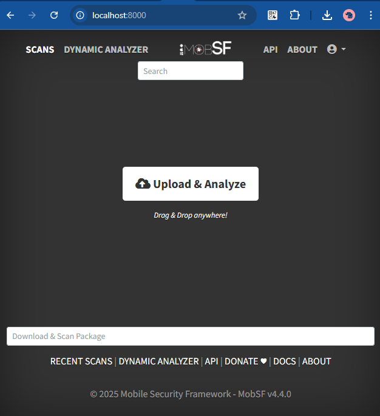
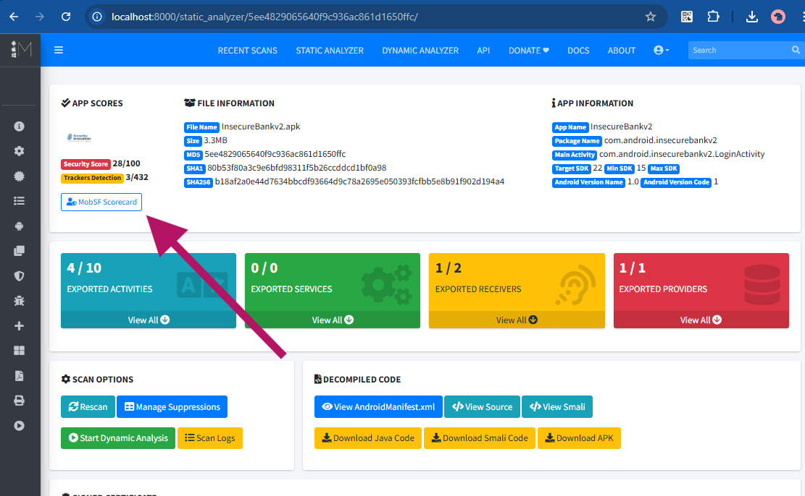
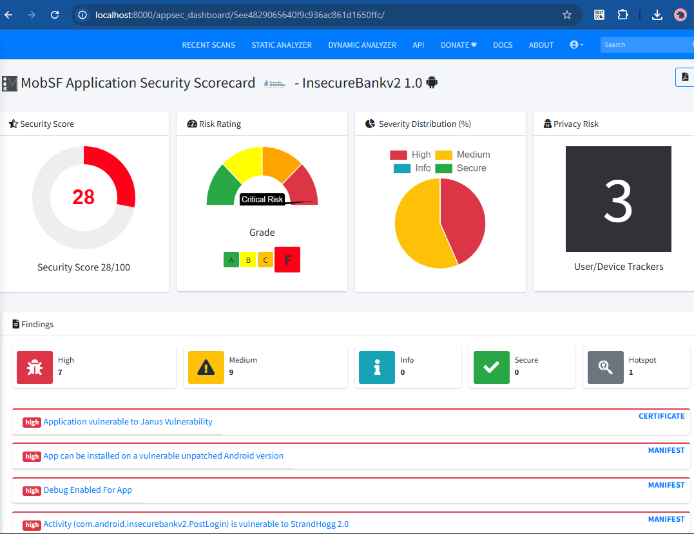

# Android App Inseguro - Análise de Segurança

Este projeto contém o APK `InsecureBankv2.apk` (pacote android com vulnerabilidades intencionais para fins educacionais) para análise de segurança usando o Mobile Security Framework (MobSF).

## Pré-requisitos

- Docker (desktop ou cli)
- Docker Compose

## Setup e Execução

### Método 1: Docker Compose (Recomendado)

1. Clone este repositório:
```bash
git clone <url-do-repositorio>
cd android-app-inseguro
```

2. Execute o MobSF usando docker-compose:
```bash
docker-compose up -d
```

3. Acesse a interface web:
```
http://localhost:8000
```

4. Faça login com as credenciais padrão:  

   - **Usuário:** `mobsf`
   - **Senha:** `mobsf`  

## Resumo como Analisar o APK

1. Após acessar a interface web do MobSF (http://localhost:8000)
2. Faça login com as credenciais `mobsf/mobsf`
3. Na página inicial, clique em "Choose File" ou arraste o arquivo
4. Selecione o arquivo `InsecureBankv2.apk` que está na raiz deste projeto
5. Clique em "Upload & Analyze"
6. Aguarde a análise ser concluída
7. Visualize o relatório de segurança gerado

# Tutorial passo a passo

1. Faça o upload do apk deste projeto [InsecureBankv2.apk](./InsecureBankv2.apk) obtido de [dineshshetty](https://github.com/dineshshetty/Android-InsecureBankv2).
  


2. Aguarde o scan estático e clique no botão `Scorecard`



3. Veja as vulnerabilidades encontradas:  



---

# Método 2: Docker Manual

```bash
docker run -d --rm -p 8000:8000 profdanizenski/mobile-security-framework-mobsf
```

## Parar o Serviço

Para parar o MobSF:
```bash
docker-compose down
```

## Sobre o InsecureBankv2

O `InsecureBankv2.apk` é uma aplicação Android intencionalmente vulnerável criada para fins educacionais e de treinamento em segurança mobile. Esta aplicação contém várias vulnerabilidades comuns encontradas em aplicações Android reais.

## Créditos e Licenças

Este projeto utiliza as seguintes ferramentas e recursos:

### Mobile Security Framework (MobSF)
- **Repositório:** https://github.com/MobSF/Mobile-Security-Framework-MobSF
- **Descrição:** Framework de segurança mobile automatizado para análise estática e dinâmica
- **Licença:** GPL-3.0

### Android InsecureBankv2
- **Repositório:** https://github.com/dineshshetty/Android-InsecureBankv2
- **Descrição:** Aplicação Android intencionalmente vulnerável para testes de segurança
- **Autor:** Dinesh Shetty
- **Licença:** Consulte o repositório original

## Aviso Legal

⚠️ **IMPORTANTE:** Este projeto é destinado apenas para fins educacionais e de pesquisa em segurança. O APK `InsecureBankv2` contém vulnerabilidades intencionais e não deve ser usado em ambientes de produção. Use apenas em ambientes controlados e isolados.

## Licença

Este projeto de documentação e configuração está disponível sob os termos que respeitam as licenças dos projetos originais mencionados acimgs/ima.

